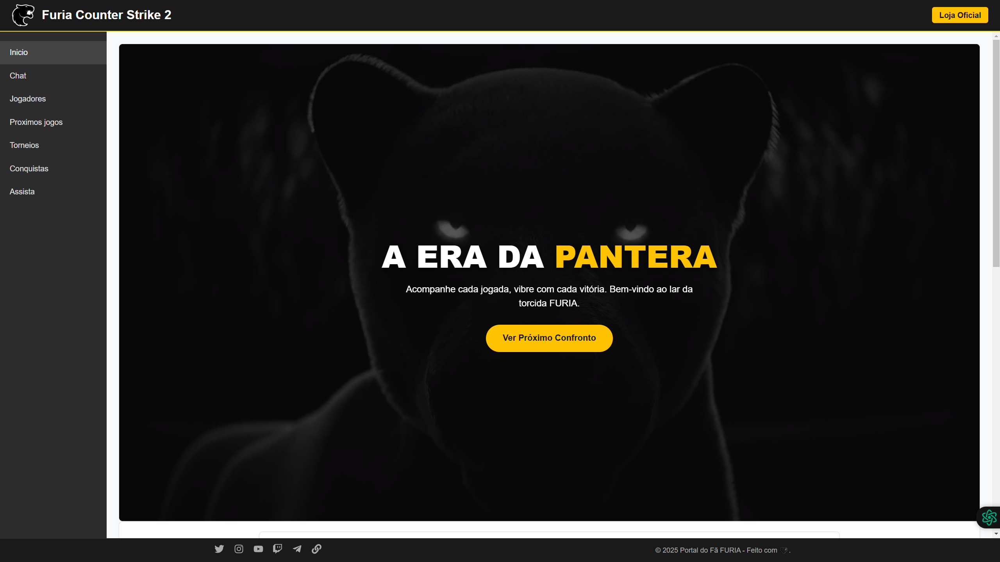
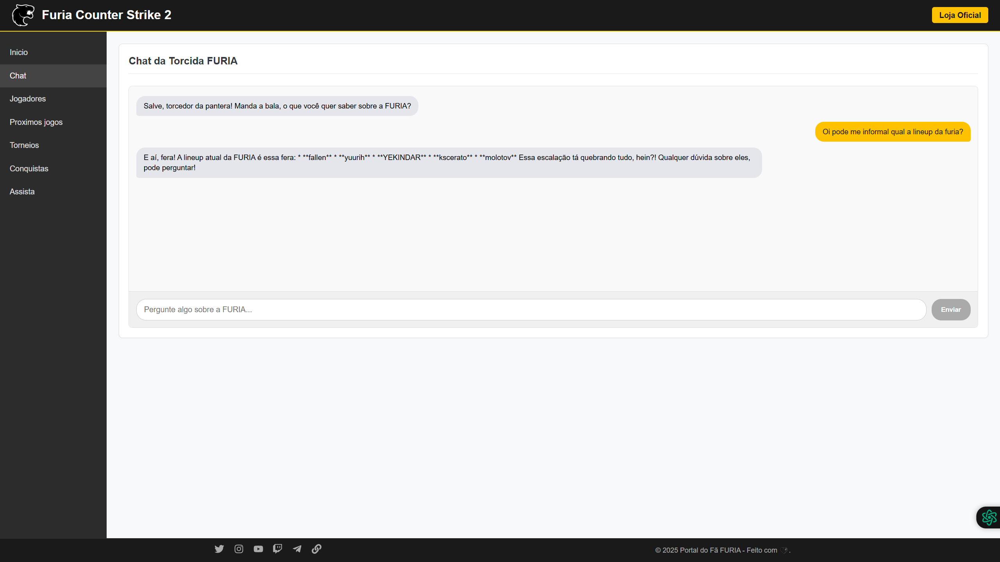
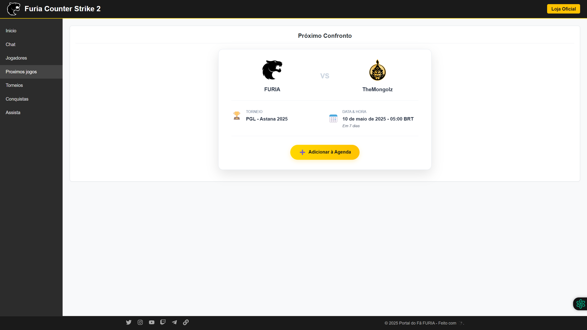
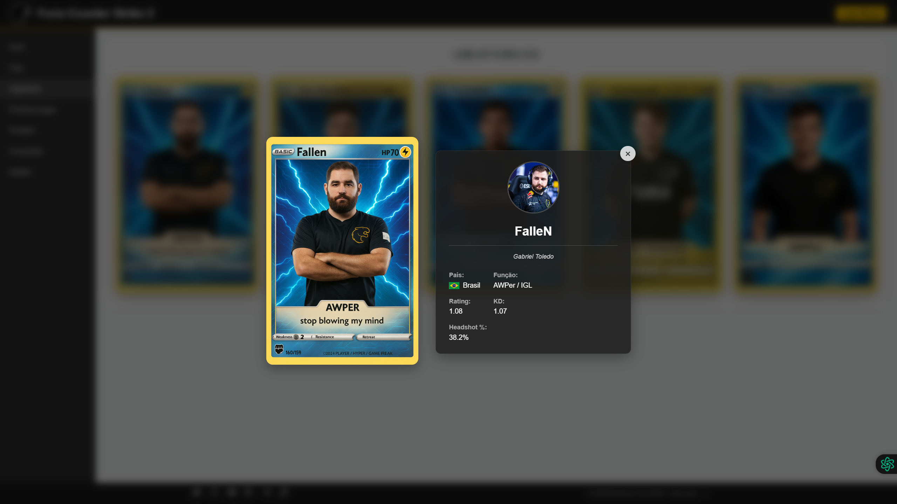

# Desafio #1 - Experiência Conversacional FURIA

Repositório para a solução do Challenge #1 - Experiência Conversacional FURIA, propondo interfaces interativas para os fãs do time de CS da organização.

## 📝 Descrição do Projeto

Este projeto visa criar um ponto central de informações e interação para a torcida da FURIA Esports, oferecendo acesso rápido a dados sobre a line-up de Counter-Strike, próximos jogos, e um espaço para conversa e engajamento. A solução inclui:

1.  **Web Chat:** Uma aplicação web moderna e responsiva com:
    - Navegação lateral intuitiva.
    - Chat interativo (potencialmente com IA para responder perguntas sobre a FURIA).
    - Seção visual de jogadores com efeito interativo.
    - Informações sobre o próximo jogo com opção de adicionar à agenda.
    - (Outras seções planejadas: Torneios, Conquistas, Assista).
2.  **Telegram Bot (Pré-existente):** Um bot para o Telegram que oferece funcionalidades similares através de comandos. _(O código específico do bot também está neste repositório)_

A ideia é proporcionar ao fã, como eu, as informações que gostaria de ver de forma rápida e engajadora.

## ✨ Funcionalidades Principais (Web Chat)

- **Navegação:** Menu lateral fixo para acessar diferentes seções.
- **Página Inicial:** Hero section impactante, destaques da line-up e próximo jogo.
- **Chat Interativo:** Interface de chat moderna com integração planejada/realizada com IA (Google Gemini) para responder perguntas sobre a FURIA (requer API Key).
- **Jogadores:** Visualização dos jogadores em formato de cards com efeito 3D/holográfico ao passar o mouse. Visão de foco com estatísticas detalhadas ao clicar no card.
- **Próximos Jogos:** Busca automática do próximo jogo oficial via API externa (PandaScore), exibindo adversário, torneio, data/hora formatada, e botão para adicionar ao Google Calendar.
- **Página Assista:** Embed de transmissão ao vivo (YouTube/Twitch).
- **(Simulado/Placeholder):** Seções de Torneios e Conquistas.
- **Footer:** Links para redes sociais oficiais da FURIA.

## 🛠️ Tecnologias Utilizadas

- **Frontend (Web Chat):**
  - React
  - TypeScript
  - Vite (Build Tool)
  - CSS Modules / CSS Padrão
  - `react-router-dom` (Roteamento)
- **Backend (API para Web Chat):**
  - Node.js
  - Express.js
  - TypeScript
  - `axios` (Requisições HTTP)
  - `@google/generative-ai` (API do Gemini)
  - `dotenv` (Variáveis de ambiente)
- **APIs Externas:**
  - Google Gemini API (Para o Chat IA)
  - PandaScore API (Para dados de partidas de CS)
- **Telegram Bot:**
  - Node.js / TypeScript
  - Biblioteca `node-telegram-bot-api` (ou similar que você usou)

## ⚙️ Configuração e Instalação

1.  **Clone o Repositório:**

    ```bash
    git clone https://github.com/RenanGroh/furia-chatbot.git
    ```

2.  **Instale as Dependências do Backend:**

    ```bash
    npm install
    ```

3.  **Instale as Dependências do Frontend:**

    ```bash
    cd web
    npm install
    cd ..
    ```

4.  **Configure as Variáveis de Ambiente:**

    - **Backend:** Crie um arquivo `.env` na **raiz principal** do projeto e adicione as seguintes variáveis (substitua pelos seus valores):
      ```dotenv
      # .env (na raiz)
      API_PORT=3001                     # Porta para a API backend
      GEMINI_API_KEY=SUA_CHAVE_GEMINI     # Chave da API Google Gemini
      PANDASCORE_API_KEY=SUA_CHAVE_PANDASCORE # Chave da API PandaScore
      FURIA_CS2_TEAM_ID=124530          # ID do time FURIA CS no PandaScore (Confirmar!)
      # Adicione a chave do Bot Telegram se ele precisar daqui também
      # TELEGRAM_BOT_TOKEN=SUA_CHAVE_TELEGRAM
      ```
    - **Frontend:** Crie um arquivo `.env` dentro da pasta `web/` e adicione:
      ```dotenv
      # web/.env
      VITE_API_URL=http://localhost:3001 # URL da sua API backend (ajuste a porta se necessário)
      ```
    - **IMPORTANTE:** Nunca comite seus arquivos `.env` no Git. Certifique-se que `.env` e `web/.env` estão no seu arquivo `.gitignore`.

5.  **Compile o Backend TypeScript:**
    ```bash
    npm run build
    ```
    _(Este comando assume que você tem um script `build` no `package.json` principal que executa `tsc`)_

## ▶️ Executando a Aplicação

Você precisará de dois terminais abertos na raiz do projeto.

1.  **Terminal 1: Iniciar a API Backend:**

    - **Modo Desenvolvimento (com recarregamento automático):**
      ```bash
      npm run dev:webapi
      ```
      _(Assume que você tem um script `dev:webapi` usando `ts-node-dev` como configuramos)_
    - **Modo Produção (após `npm run build`):**
      ```bash
      npm run start:webapi
      ```
      _(Assume que você tem um script `start:webapi` que executa `node dist/main-webapi.js`)_

2.  **Terminal 2: Iniciar o Frontend React (Vite):**

    ```bash
    cd web
    npm run dev
    ```

3.  **Acesse:**
    - O **Web Chat** estará disponível em `http://localhost:5173` (ou a porta que o Vite indicar).
    - A **API Backend** estará rodando em `http://localhost:3001` (ou a porta definida no `.env`).

_(Instruções para rodar o Bot do Telegram podem ser adicionadas aqui se ele tiver um script de inicialização separado, ex: `npm run start:telegram`)_

## 🖼️ Screenshots (Opcional)

_(Adicione screenshots aqui para mostrar a aparência da aplicação!)_

- 
- 
- 
- 

## 🚀 Próximos Passos (Possíveis Melhorias)

- Implementar as seções de Torneios e Conquistas.
- Adicionar mais fontes de dados para notícias e estatísticas.
- Melhorar a capacidade de contexto e histórico do Chat IA.
- Otimizar performance e tratamento de erros.
- Deploy da aplicação web e API.

##👤 Autor

- **[Renan Groh]**
- **Contato:** Renangroh@gmail.com

---

Feito para o Challenge #1 da FURIA
